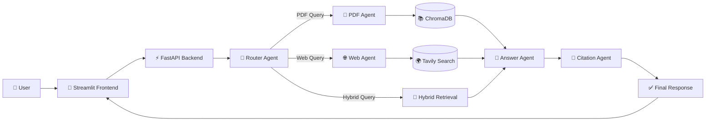
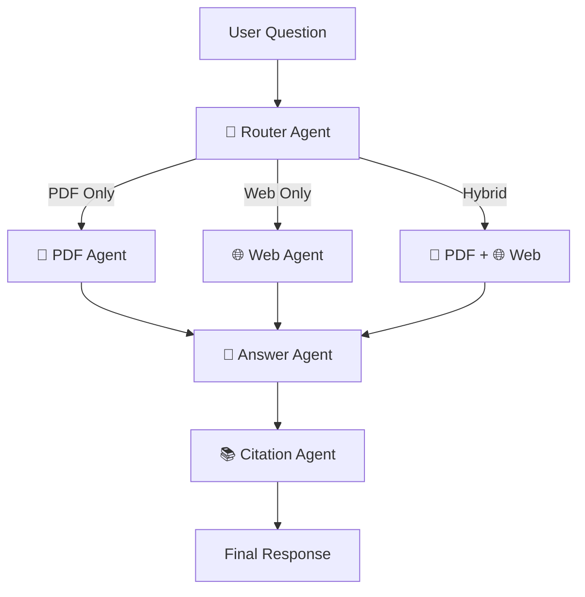
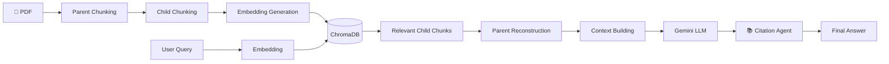

<div align="center">

# 🧠 OmniResearch AI

### AI-Powered Multi-Agent Research Assistant using Parent–Child RAG, Hybrid Retrieval & Real-Time Web Search

[](https://www.python.org/)
[](https://fastapi.tiangolo.com/)
[](https://streamlit.io/)
[](https://www.trychroma.com/)
[](https://ai.google.dev/)
[](https://tavily.com/)
[](LICENSE)

</div>

---

## 🚀 Live Demo

| Service | URL |
|----------|-----|
| 🌐 Frontend | **Coming Soon** |
| ⚡ Backend API | **Coming Soon** |

---

## 📖 Overview

OmniResearch AI is a **production-ready Multi-Agent Retrieval-Augmented Generation (RAG) system** designed to answer user queries by combining information from uploaded documents and the live web.

Instead of relying solely on semantic retrieval, the system implements a **Parent–Child RAG architecture** that preserves document context while enabling fine-grained retrieval. A dedicated **Router Agent** intelligently decides whether a query should use PDF knowledge, web search, or both, allowing the assistant to generate accurate, citation-backed responses.

The application is built using **FastAPI**, **Streamlit**, **ChromaDB**, **Gemini**, and **Tavily**, making it suitable for research, academic documents, technical manuals, and knowledge-intensive workflows.

---

## ✨ Key Features

- 🤖 Multi-Agent Architecture
- 📄 Parent–Child RAG Pipeline
- 🔍 Hybrid Retrieval (Semantic + BM25)
- 🌐 Real-Time Web Search
- 📚 Citation-Aware Responses
- 📂 Multi-PDF Knowledge Base
- 💬 Conversational Memory
- ⚡ FastAPI Backend
- 🎨 Streamlit Interface
- 🚀 Ready for Cloud Deployment

---

# 📸 Application Preview

## 🏠 Homepage


---

## 🔄 Hybrid Search

Upload multiple PDFs and seamlessly combine document knowledge with real-time web search.


---

## 📄 PDF Response

The assistant retrieves relevant parent chunks from uploaded documents and generates context-aware answers.


---

## 🌐 Web Response

For queries requiring recent or external knowledge, the Web Agent retrieves live information before answer generation.


---

## 📚 Citation Support

Every response is accompanied by source references, improving transparency and trustworthiness.


# 🏗️ System Architecture

The application follows a modular **Multi-Agent Architecture**, where every agent is responsible for a single task. This separation improves scalability, maintainability, and response quality.



---

# 🤖 Multi-Agent Workflow

Every user query passes through an intelligent routing system before answer generation.



---

# 📄 Parent–Child RAG Pipeline

Traditional RAG often loses context when documents are divided into smaller chunks.

OmniResearch AI solves this using a **Parent–Child Retrieval strategy**, where:

- Large **Parent Chunks** preserve semantic context.
- Smaller **Child Chunks** improve retrieval precision.
- Retrieved child chunks reconstruct their corresponding parent chunks before answer generation.



---

# 🔍 Hybrid Retrieval Strategy

Instead of relying on a single retrieval method, OmniResearch AI combines **dense semantic search** with **lexical keyword matching**.

### Retrieval Pipeline

```text
User Query
      │
      ▼
Sentence Transformer Embedding
      │
      ▼
Semantic Search (ChromaDB)
      │
      ▼
BM25 Keyword Search
      │
      ▼
Score Fusion
      │
      ▼
Best Child Chunks
      │
      ▼
Parent Reconstruction
      │
      ▼
Gemini Response
```

### Why Hybrid Retrieval?

| Semantic Search | BM25 Search |
|-----------------|------------|
| Understands meaning | Matches exact keywords |
| Handles paraphrased queries | Excellent for technical terms |
| Captures semantic similarity | Improves precision |
| May miss exact terminology | Complements dense retrieval |

Combining both retrieval methods results in significantly more reliable document retrieval compared to using either technique alone.
# 🚀 Project Development Journey

The project was developed incrementally, with each stage improving the retrieval quality, modularity, and overall intelligence of the system.

| Phase | Description |
|-------|-------------|
| 📄 PDF Parsing | Extracted structured text from uploaded PDF documents. |
| ✂️ Parent Chunking | Split documents into large contextual chunks to preserve semantic meaning. |
| 🧩 Child Chunking | Further divided parent chunks into smaller retrieval units for higher precision. |
| 🧠 Embedding Generation | Generated dense vector representations using Sentence Transformers. |
| 🗂️ Vector Storage | Stored child embeddings in ChromaDB while maintaining parent-child relationships. |
| 🔍 Hybrid Retrieval | Combined semantic search with BM25 keyword retrieval for improved accuracy. |
| 📑 Parent Reconstruction | Reconstructed complete parent chunks from retrieved child chunks before LLM inference. |
| 🤖 Gemini Integration | Generated natural language responses using Google's Gemini model. |
| 🌐 Web Search | Added Tavily-powered web retrieval for answering real-time and out-of-document queries. |
| 🧠 Multi-Agent Architecture | Introduced Router, PDF, Web, Answer, and Citation agents for modular execution. |
| 📚 Citation System | Attached document and web references to improve transparency and trustworthiness. |
| 🎨 User Interface | Built an interactive Streamlit frontend with document upload and chat capabilities. |
| ⚡ Backend API | Developed a FastAPI backend for scalable request handling. |
| ☁️ Cloud Deployment | Prepared the application for deployment on Railway and Streamlit Community Cloud. |

---

# 🛠️ Technology Stack

| Category | Technologies |
|----------|--------------|
| **Programming Language** | Python |
| **Frontend** | Streamlit |
| **Backend** | FastAPI |
| **LLM** | Google Gemini |
| **Embeddings** | Sentence Transformers |
| **Vector Database** | ChromaDB |
| **Document Processing** | LangChain |
| **Retrieval** | Parent–Child RAG + Hybrid Retrieval (Semantic + BM25) |
| **Web Search** | Tavily API |
| **API Validation** | Pydantic |
| **Deployment** | Railway • Streamlit Community Cloud |
| **Version Control** | Git & GitHub |

---

# 📂 Project Structure

```text
OmniResearchAI
│
├── 📁 backend
│   ├── 🤖 agents.py                # Multi-Agent orchestration
│   ├── ⚡ app.py                   # FastAPI backend
│   ├── ⚙️ config.py                # Configuration & constants
│   ├── 🧠 memory.py                # Conversation memory
│   ├── 📄 pdf_parser.py            # PDF parsing utilities
│   ├── 💬 prompts.py               # LLM prompt templates
│   ├── 📚 rag.py                   # Parent–Child RAG pipeline
│   ├── 📑 parent_store.json        # Persistent parent chunk store
│   │
│   ├── 📂 uploads/                 # Uploaded PDF documents
│   └── 📂 chroma_db/               # ChromaDB vector database
│
├── 🎨 frontend
│   ├── 📂 .streamlit
│   │   └── config.toml             # Streamlit configuration
│   │
│   ├── 🔌 api.py                   # Backend API communication
│   ├── 🧩 components.py            # Reusable UI components
│   ├── 📐 layout.py                # Page layout
│   ├── 📋 sidebar.py               # Sidebar interface
│   ├── 🚀 streamlit_app.py         # Streamlit application entry point
│   ├── 🎨 styles.py                # UI styling utilities
│   └── 🎨 styles.css               # Custom CSS styling
│
├── 📸 screenshots
│   ├── homepage.png
│   ├── hybrid_search.png
│   ├── pdf_response.png
│   ├── web_response.png
│   └── citations.png
│
├── 📄 requirements.txt             # Project dependencies
├── 📖 README.md                    # Project documentation
├── 📜 LICENSE                      # MIT License
├── 🔒 .gitignore                   # Git ignore rules
├── 🔑 .env                         # Environment variables (local only)
└── 🐍 venv/                        # Virtual environment (ignored by Git)
```

---

# 🎯 Why Parent–Child RAG?

Most traditional RAG systems directly embed small document chunks.

While this improves retrieval speed, it often loses the surrounding context required for generating accurate answers.

OmniResearch AI addresses this limitation by introducing a **Parent–Child Retrieval Pipeline**.

### Benefits

- 📖 Preserves document context
- 🎯 Retrieves smaller, highly relevant chunks
- 🔄 Reconstructs larger contextual sections before LLM inference
- 📚 Produces more coherent and reliable answers
- 🚀 Scales efficiently for large document collections

This architecture significantly improves answer quality compared to conventional chunk-based RAG systems.
# ⚙️ Installation

## 1️⃣ Clone the Repository

```bash
git clone https://github.com/shubhamm-27/OmniResearchAI.git

cd OmniResearchAI
```

---

## 2️⃣ Create Virtual Environment

### Windows

```bash
python -m venv venv

venv\Scripts\activate
```

### Linux / macOS

```bash
python3 -m venv venv

source venv/bin/activate
```

---

## 3️⃣ Install Dependencies

```bash
pip install -r requirements.txt
```

---

## 4️⃣ Configure Environment Variables

Create a **`.env`** file inside the **backend** directory.

```env
GEMINI_API_KEY=YOUR_GEMINI_API_KEY

TAVILY_API_KEY=YOUR_TAVILY_API_KEY
```

---

## 5️⃣ Start Backend

```bash
cd backend

uvicorn app:app --reload
```

Backend will run at

```
http://localhost:8000
```

---

## 6️⃣ Start Frontend

Open another terminal.

```bash
cd frontend

streamlit run streamlit_app.py
```

Frontend will run at

```
http://localhost:8501
```

---

# 🚀 Deployment

| Service | Platform |
|----------|----------|
| Frontend | Streamlit Community Cloud |
| Backend | Railway |
| Version Control | GitHub |

> **Live Demo URLs**

**🌐 Frontend**

```
Coming Soon
```

**⚡ Backend API**

```
Coming Soon
```

---

# 📈 Future Improvements

- 📄 OCR support for scanned PDFs
- 🖼️ Image-aware document retrieval
- 🧠 Agentic planning with autonomous reasoning
- 💾 Long-term conversation memory
- 👥 User authentication
- 📊 Analytics dashboard
- ☁️ Cloud storage integration
- 🐳 Docker support
- 🤖 Local LLM compatibility
- 📱 Mobile-responsive interface

---

# 👨‍💻 Author

## Shubham Sharma

**Aspiring AI Engineer | Machine Learning Enthusiast**

📧 **Email:** shubham789keeds@gmail.com

💼 **LinkedIn:** [Shubham Sharma](https://www.linkedin.com/in/shubhammm27/)

---
