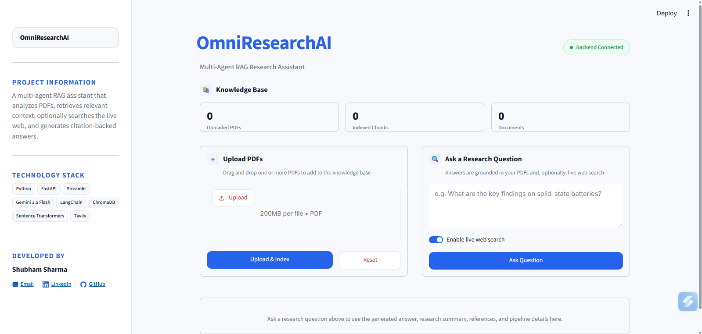
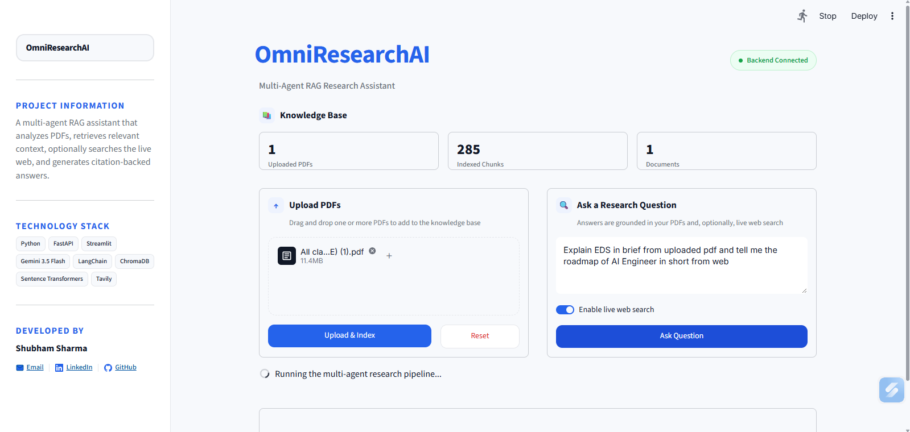
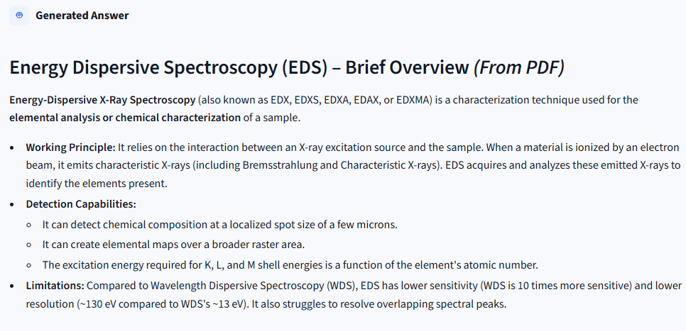
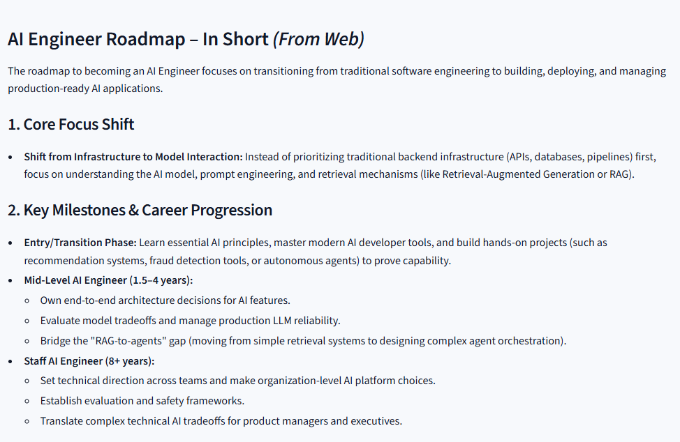
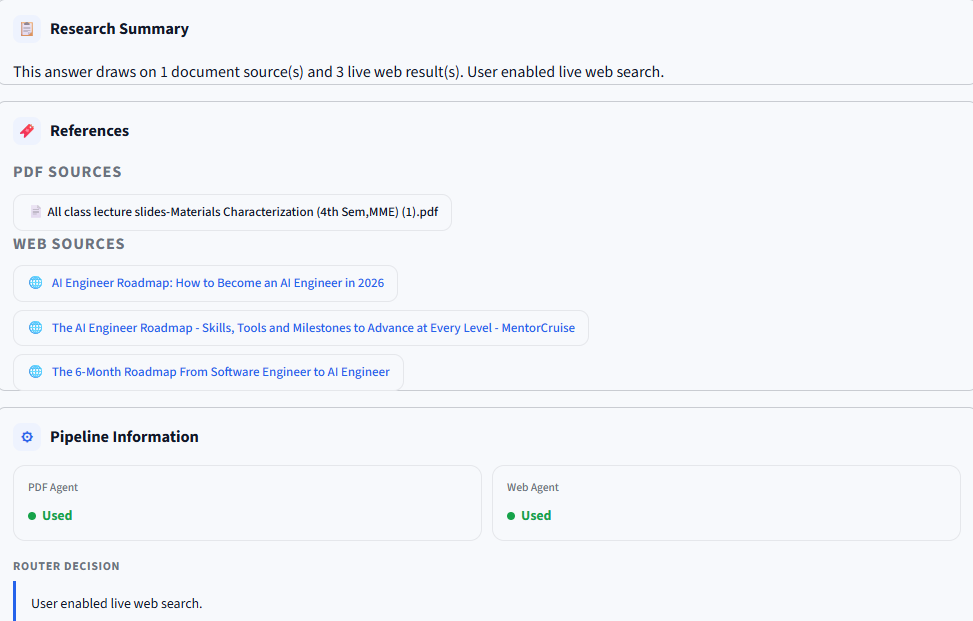
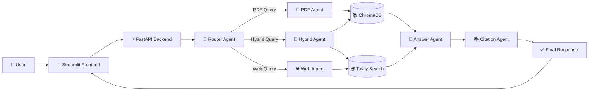
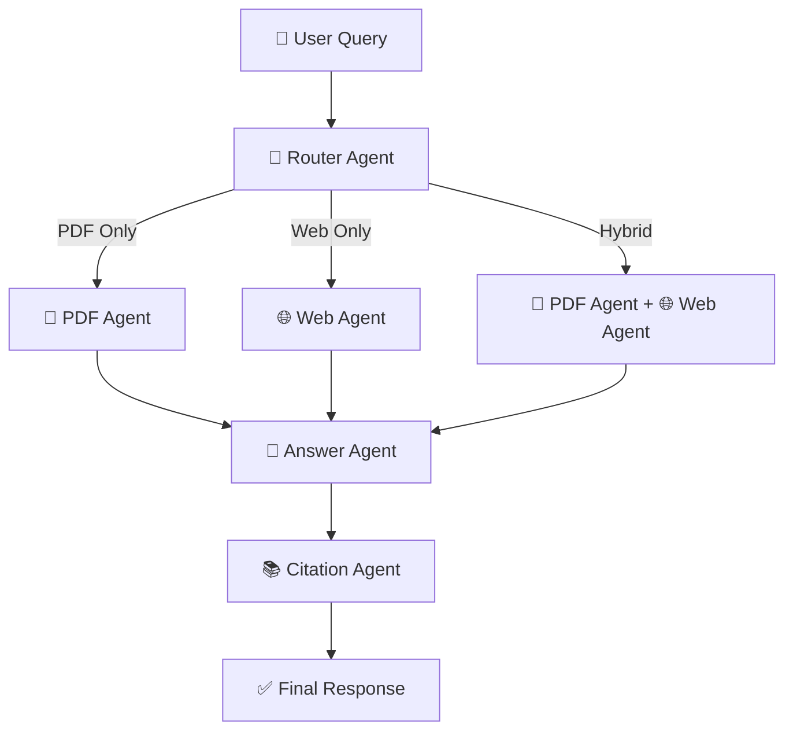
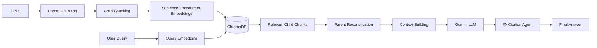

# OmniResearchAI

### AI-Powered Multi-Agent Research Assistant with Parent–Child RAG & Real-Time Web Search

[](https://www.python.org/)
[](https://fastapi.tiangolo.com/)
[](https://streamlit.io/)
[](https://www.trychroma.com/)
[](https://ai.google.dev/)
[](https://www.sbert.net/)
[](https://tavily.com/)

---

# 📖 Overview

OmniResearchAI is a **production-ready Multi-Agent Retrieval-Augmented Generation (RAG) system** that answers user queries by intelligently combining knowledge from uploaded PDF documents with live information from the web.

Unlike traditional RAG systems that directly retrieve isolated chunks, OmniResearchAI implements a **Parent–Child Retrieval Pipeline**, where small child chunks are embedded for precise semantic search while larger parent chunks preserve contextual information for the language model.

A dedicated **Router Agent** determines whether a question should be answered using:

- 📄 Uploaded PDF documents
- 🌐 Live web search
- 🔀 Both sources together

The retrieved context is passed to **Google Gemini**, while a dedicated **Citation Agent** attaches document and web references to every generated response.

Built with **FastAPI**, **Streamlit**, **Sentence Transformers**, **ChromaDB**, **Gemini**, and **Tavily**, OmniResearchAI is suitable for:

- Academic research
- Technical documentation
- Company knowledge bases
- Scientific literature
- Multi-document question answering

---

# ✨ Key Features

- 🤖 Multi-Agent Architecture
- 📄 Parent–Child RAG Pipeline
- 🧠 Dense Semantic Retrieval
- 🌐 Real-Time Web Search
- 🧭 Intelligent Query Routing
- 📚 Citation-Aware Responses
- 📂 Multi-PDF Knowledge Base
- 💬 Conversational Memory
- ⚡ FastAPI Backend
- 🎨 Streamlit Frontend

---

# 📸 Application Preview

## 🏠 Homepage



---

## 🔄 Hybrid Knowledge Retrieval

Upload multiple PDFs and seamlessly combine document knowledge with real-time web search.



---

## 📄 PDF Response

The assistant retrieves relevant parent chunks from uploaded documents and generates context-aware answers.



---

## 🌐 Web Response

For queries requiring recent or external knowledge, the Web Agent retrieves live information before answer generation.



---

## 📚 Citation Support

Every generated response is accompanied by document and web references, improving transparency and trustworthiness.



# 🏗️ System Architecture

The application follows a modular **Multi-Agent Architecture**, where each agent is responsible for a single task. This separation improves scalability, maintainability, and answer quality.


---

# 🤖 Multi-Agent Workflow

Every user query passes through an intelligent routing system before answer generation.



---

# 📄 Parent–Child RAG Pipeline

Traditional RAG systems often split documents into small chunks and retrieve them directly. While this improves retrieval precision, it frequently loses the surrounding context needed for high-quality answers.

OmniResearchAI addresses this limitation using a **Parent–Child Retrieval Pipeline**.

### How it works

- Large **Parent Chunks** preserve semantic context.
- Smaller **Child Chunks** are generated from each parent.
- Only child chunks are embedded and indexed.
- During retrieval, relevant child chunks reconstruct their corresponding parent chunks before answer generation.



---

# 🔍 Semantic Retrieval Strategy

OmniResearchAI uses a **dense semantic retrieval pipeline** powered by **Sentence Transformers** and **ChromaDB**.

Instead of retrieving entire documents directly, the system searches over embedded child chunks, reconstructs their parent chunks, and provides rich contextual information to the language model.

### Retrieval Pipeline

```text
User Query
      │
      ▼
Sentence Transformer Embedding
      │
      ▼
Semantic Search (ChromaDB)
      │
      ▼
Top-K Child Chunks
      │
      ▼
Parent Reconstruction
      │
      ▼
Context Building
      │
      ▼
Gemini Response
      │
      ▼
Citation Generation
```

### Why Parent–Child Retrieval?

| Traditional Chunk Retrieval | Parent–Child Retrieval |
|----------------------------|-------------------------|
| Retrieves isolated chunks | Retrieves complete contextual sections |
| Context may be fragmented | Context is preserved |
| Better retrieval precision | Better retrieval precision **and** answer quality |
| Smaller context window | Rich document-level understanding |
| Suitable for simple QA | Ideal for research and technical documentation |

By reconstructing parent chunks before LLM inference, OmniResearchAI preserves document structure while maintaining precise semantic retrieval, resulting in more coherent and reliable responses.

# 🚀 Project Development Journey

The project was developed incrementally, with each phase improving retrieval quality, scalability, and overall intelligence of the system.

| Phase | Description |
|-------|-------------|
| 📄 PDF Parsing | Extracted clean text from uploaded PDF documents using PyPDF. |
| ✂️ Parent Chunking | Split documents into large contextual parent chunks. |
| 🧩 Child Chunking | Further divided parent chunks into smaller retrieval units. |
| 🧠 Embedding Generation | Generated dense embeddings using Sentence Transformers (all-MiniLM-L6-v2). |
| 🗂️ Vector Storage | Stored child embeddings inside ChromaDB while preserving parent-child relationships. |
| 📑 Parent Reconstruction | Reconstructed complete parent chunks before LLM inference. |
| 🤖 Gemini Integration | Integrated Google's Gemini model for response generation. |
| 🌐 Web Search | Added Tavily-powered live web retrieval for up-to-date information. |
| 🧭 Router Agent | Built an intelligent Router Agent to choose between PDF, Web, or Hybrid execution. |
| 📚 Citation System | Added document and web citations for every generated answer. |
| 💬 Conversational Memory | Maintained previous conversation history for follow-up questions. |
| 🎨 User Interface | Developed an interactive Streamlit frontend. |
| ⚡ Backend API | Implemented FastAPI backend for document indexing and querying. |
| ☁️ Cloud Deployment | Deployed the frontend on Streamlit Community Cloud and backend on Railway. |

---

# 🛠️ Technology Stack

| Category | Technologies |
|----------|--------------|
| **Programming Language** | Python |
| **Frontend** | Streamlit |
| **Backend** | FastAPI |
| **LLM** | Google Gemini |
| **Embeddings** | Sentence Transformers (all-MiniLM-L6-v2) |
| **Vector Database** | ChromaDB |
| **Document Processing** | LangChain Text Splitters + PyPDF |
| **Retrieval** | Parent–Child RAG |
| **Semantic Search** | ChromaDB Dense Vector Search |
| **Web Search** | Tavily API |
| **Conversation Memory** | Custom Memory Module |
| **Deployment** | Railway • Streamlit Community Cloud |
| **Version Control** | Git & GitHub |

---

# 📂 Project Structure

```text
OmniResearchAI
│
├── 📁 backend
│   ├── 🤖 agents.py                # Multi-Agent orchestration
│   ├── ⚡ app.py                   # FastAPI backend
│   ├── ⚙️ config.py                # Configuration & constants
│   ├── 🧠 memory.py                # Conversation memory
│   ├── 📄 pdf_parser.py            # PDF parsing utilities
│   ├── 💬 prompts.py               # LLM prompt templates
│   ├── 📚 rag.py                   # Parent–Child RAG pipeline
│   ├── 📑 parent_store.json        # Persistent parent chunk store
│   │
│   ├── 📂 uploads/                 # Uploaded PDF documents
│   └── 📂 chroma_db/               # ChromaDB vector database
│
├── 🎨 frontend
│   ├── 📂 .streamlit
│   │   └── config.toml             # Streamlit configuration
│   │
│   ├── 🔌 api.py                   # Backend API communication
│   ├── 🧩 components.py            # Reusable UI components
│   ├── 📐 layout.py                # Page layout
│   ├── 📋 sidebar.py               # Sidebar interface
│   ├── 🚀 streamlit_app.py         # Streamlit application entry point
│   ├── 🎨 styles.py                # UI styling utilities
│   └── 🎨 styles.css               # Custom CSS styling
│
├── 📸 screenshots
│   ├── homepage.png
│   ├── hybrid_search.png
│   ├── pdf_response.png
│   ├── web_response.png
│   └── citations.png
│
├── 📄 requirements.txt             # Project dependencies
├── 📖 README.md                    # Project documentation
├── 📜 LICENSE                      # MIT License
├── 🔒 .gitignore                   # Git ignore rules
```

---

# ⚙️ Installation

## 1️⃣ Clone the Repository

```bash
git clone https://github.com/shubhamm-27/OmniResearchAI.git

cd OmniResearchAI
```

---

## 2️⃣ Create a Virtual Environment

### Windows

```bash
python -m venv venv

venv\Scripts\activate
```

### Linux / macOS

```bash
python3 -m venv venv

source venv/bin/activate
```

---

## 3️⃣ Install Dependencies

```bash
pip install -r requirements.txt
```

---

## 4️⃣ Configure Environment Variables

Create a **`.env`** file inside the **backend** directory.

```env
GEMINI_API_KEY=YOUR_GEMINI_API_KEY

TAVILY_API_KEY=YOUR_TAVILY_API_KEY
```

---

## 5️⃣ Start the Backend

```bash
cd backend

uvicorn app:app --reload
```

Backend will run at:

```
http://localhost:8000
```

---

## 6️⃣ Start the Frontend

Open another terminal.

```bash
cd frontend

streamlit run streamlit_app.py
```

Frontend will run at:

```
http://localhost:8501
```

---

# 🌐 Live Demo

**🚀 Live Application**

https://omniresearchai.streamlit.app/

> **Note**
>
> The backend is hosted on **Railway (Free Tier)**.
> If the backend is idle, Railway may put it to sleep.
> The first request can therefore take **30–60 seconds** while the backend wakes up.

---

# 📈 Future Improvements

The current system is designed with a modular architecture, making it easy to extend with additional capabilities.

Future enhancements include:

- 📄 OCR support for scanned PDFs
- 🖼️ Image-aware document understanding
- 🧠 Advanced agentic planning and reasoning
- 💾 Persistent long-term conversation memory
- 👥 User authentication and workspace management
- 📊 Usage analytics dashboard
- ☁️ Cloud storage integration
- 🐳 Docker containerization
- 🤖 Local LLM compatibility (Ollama / vLLM)
- 📱 Fully responsive mobile interface

---

# 👨‍💻 Author

## Shubham Sharma

*Aspiring AI Engineer | Machine Learning Enthusiast*

📧 *Email:* shubham789keeds@gmail.com

💼 *LinkedIn:* [Shubham Sharma](https://www.linkedin.com/in/shubhammm27/)

---
